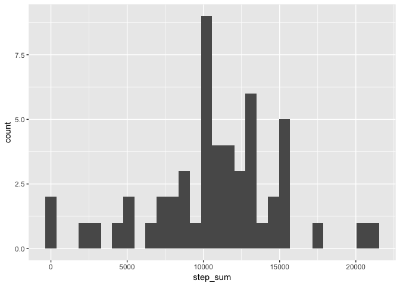
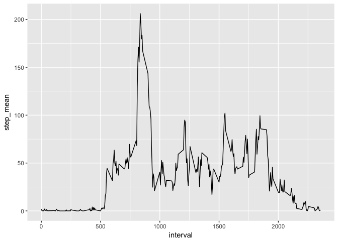
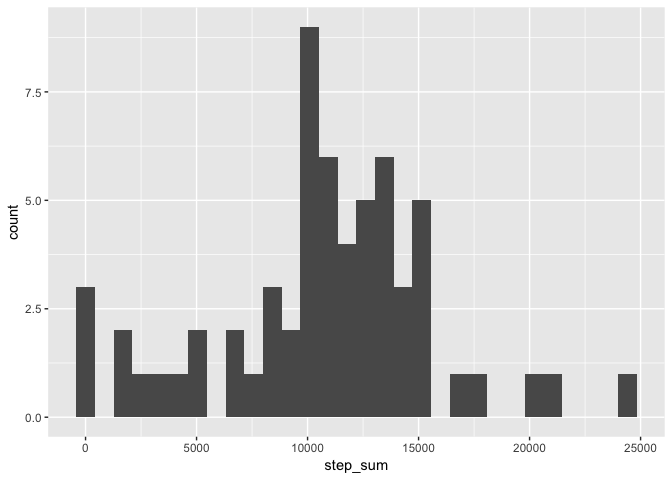
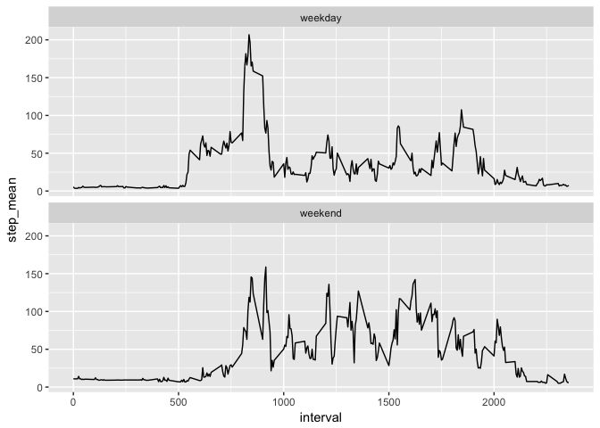

# Reproducible Research: Peer Assessment 1


## Loading and preprocessing the data

```r
library(dplyr)
```

```
## 
## Attaching package: 'dplyr'
```

```
## The following objects are masked from 'package:stats':
## 
##     filter, lag
```

```
## The following objects are masked from 'package:base':
## 
##     intersect, setdiff, setequal, union
```

```r
library(ggplot2)
if (!file.exists("activity.csv"))
    unzip("activity.zip")

data <- read.csv("activity.csv")

# convert date column to Date type
data <- data %>% mutate(date = as.Date(as.character(date)))
```

## What is mean total number of steps taken per day?

```r
# get the total steps per day
sum_per_day <- data %>% group_by(date) %>% summarise(step_sum = sum(steps))

g <- ggplot(data=sum_per_day, aes(step_sum))
g + geom_histogram(na.rm = TRUE)
```

```
## `stat_bin()` using `bins = 30`. Pick better value with `binwidth`.
```

<!-- -->


```r
# get the mean
step_mean <- mean(sum_per_day$step_sum, na.rm=TRUE)
step_median <- median(sum_per_day$step_sum, na.rm=TRUE)
```
the step mean total per day: 1.0766189\times 10^{4}  
the step median total per day: 10765


## What is the average daily activity pattern?

```r
step_mean_interval <- data %>% group_by(interval) %>% summarise(step_mean=mean(steps, na.rm=TRUE))

g <- ggplot(data = step_mean_interval, aes(x=interval, y=step_mean))
g+geom_line()
```

<!-- -->

```r
max_index <- which.max(step_mean_interval$step_mean)
max_interval <- step_mean_interval[max_index, "interval"]
```
835 interval contains the maximum number of steps, on average across all the days in the dataset.

## Imputing missing values

```r
row_na <- sum(!complete.cases(data))

# use step mean for that 5-minute interval to impute.
impute_steps <-
    data[!complete.cases(data),] %>% 
    merge(step_mean_interval, by="interval", all.x = TRUE) %>%
    select(step_mean)

new_data <- data
new_data[!complete.cases(data), "steps"] <- impute_steps
```
There are 2304 rows contain NA.


```r
# get the total steps per day
new_sum_per_day <- new_data %>% group_by(date) %>% summarise(step_sum = sum(steps))

g <- ggplot(data=new_sum_per_day, aes(step_sum))
g + geom_histogram()
```

```
## `stat_bin()` using `bins = 30`. Pick better value with `binwidth`.
```

<!-- -->


```r
# get the mean
new_step_mean <- mean(new_sum_per_day$step_sum)
new_step_median <- median(new_sum_per_day$step_sum)
```
the step mean total per day after imputation: 1.0766189\times 10^{4}  
the step median total per day after imputation: 1.1015\times 10^{4}  
Compared to data before imputation, mean doesn't change, but median changes a bit. After imputation, the total daily number of steps increases apparently.


## Are there differences in activity patterns between weekdays and weekends?

```r
new_data$day.type <- as.factor(ifelse(weekdays(new_data$date) %in% c("Saturday", "Sunday"), "weekend", "weekday"))

step_mean_w_i <- new_data %>% group_by(day.type, interval) %>% summarise(step_mean=mean(steps))

g <- ggplot(data = step_mean_w_i, aes(x=interval, y=step_mean))
g + geom_line() + facet_wrap(~day.type, nrow=2)
```

<!-- -->
